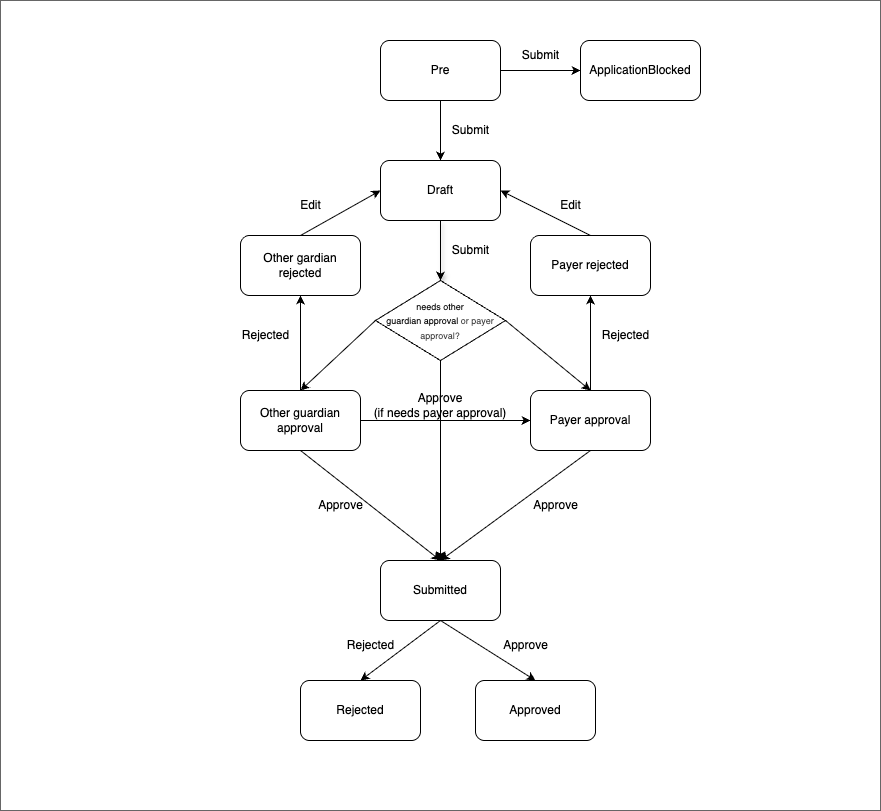

# New Primary School - Directorate of Education and School Services (DESS)

## Innritun í 1. bekk, Umsókn um skólavist, Umsókn um áframhaldandi skólavist

## About

This application template allows applicants to apply for a school transfer, continuation and enrollment in first grade.

### States

#### Prerequisites

This state is a temporary state in which all new applications are created. It has a short lifespan and is unlisted. In this state, there is an external data step that fetches data from Þjóðskrá and MMS. If the user has child/children to apply for, they select them in this state.

#### Draft

If the applicant has a child to apply for, they advance to the draft state. In this state, they complete the actual application.

The application also goes to the draft state if the other guardian or the payer rejects it. In this case, the application must be modified, and the modifications are completed in this state.

#### Other guardian approval

If there is another guardian, they need to approve the application for it to advance to the next state.

#### Other guardian rejected

The other guardian can reject the application. If so, the applicant needs to modify the application and resubmit it.

#### Payer approval

If the application is for a private school, the applicant can register a payer to cover the tuition fees. The payer can be anyone, but is often the employer of one of the parents. For example, in most cases, the parent is a foreign national who is coming to Iceland for temporary work and enrolling their children in an international school (private school).

#### Payer rejected

If for some reason the payer rejects the application, it goes to this state. The applicant needs to modify the application and resubmit it.

#### Submitted

The application enters this state once all required approvals have been completed. If other guardian and/or payer approvals are required, they must be obtained before the application moves from Draft to Submitted. Otherwise, it moves directly from Draft to Submitted.

#### Approved

The application has been approved by MMS.

#### Rejected

The application has been rejected by MMS.

## Integrations

- [Þjóðskrá](https://skra.is): To get the applicants information

## Setup

See [application-system](../../../../apps/application-system/README.md) setup on how to get started.

Once you have everything running you can navigate to [http://localhost:4242/umsoknir/grunnskoli](http://localhost:4242/umsoknir/grunnskoli) and start developing.

## Localisation

All localisation can be found on Contentful.

- [New primary school application translations](https://app.contentful.com/spaces/8k0h54kbe6bj/entries/nps.application)

When creating new text strings in the messages.ts file for the application, be sure to update Contentful, see [message extraction](../../../../localization/README.md#message-extraction).

## Code owners and maintainers

- [Deloitte](http://www.deloitte.is)
