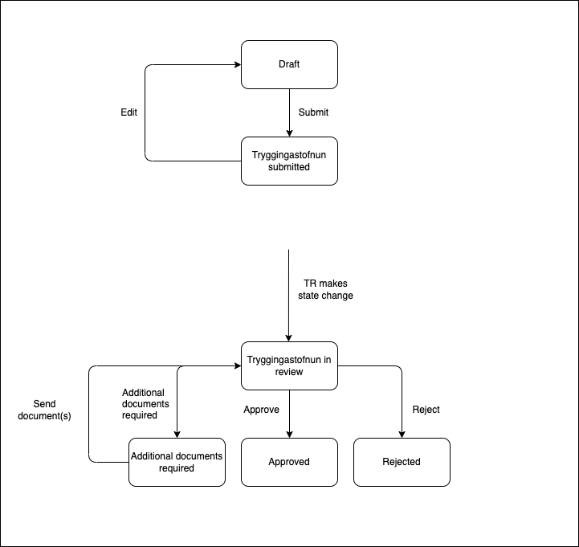

# Application Templates Old age pension

## Description

This application template allows applicants to apply for old age pension. 

### States
#### Prerequisites

This state is a temporary state that all new applications will be created in. It has a short lifespan and is unlisted.

The purpose of this state is to be a guard into the actual application. There the applicant chooses type of old age pension (old age pension, half old age pension and sailor's old age pension) and reads general information on the processing and data collection for applications at TR. There is an external data step which fetches data from Þjóðskrá, TR and user profile. And lastly there is a question step about if applicant has applied from all their pension funds, if they have not they cannot advance to the next step and make an application.

#### Draft

Valid applicants will be able to advance to this state where they can start the actual application and fill in all the relevant data.

#### Tryggingastofnun submitted

When applicant has sent in his application to TR the application is in this state. Here the applications can be edited.

#### Tryggingastofnun in review

Application are in this state when Tryggingastofnun starts to review the application. Here the applications can not be edited.

#### Additional document required

TR asks for additional documents while processing the application.

#### Approved

Applicantions have been approved by TR.

#### Rejected

Applicantions have been rejected by TR.

### Localisation

All localisation can be found on Contentful.

- [Old age pension application translations](https://app.contentful.com/spaces/8k0h54kbe6bj/entries/oap.application)
- [Application system translations](https://app.contentful.com/spaces/8k0h54kbe6bj/entries/application.system)

When creating new text strings in the messages.ts file for the application, be sure to update Contentful, see [message extraction](../../../localization/README.md#message-extraction).

## Setup

See [application-system](../../../../apps/application-system/README.md) setup on how to get started.

Once you have everything running you can navigate to [http://localhost:4242/umsoknir/ellilifeyrir](http://localhost:4242/umsoknir/ellilifeyrir) and start developing.