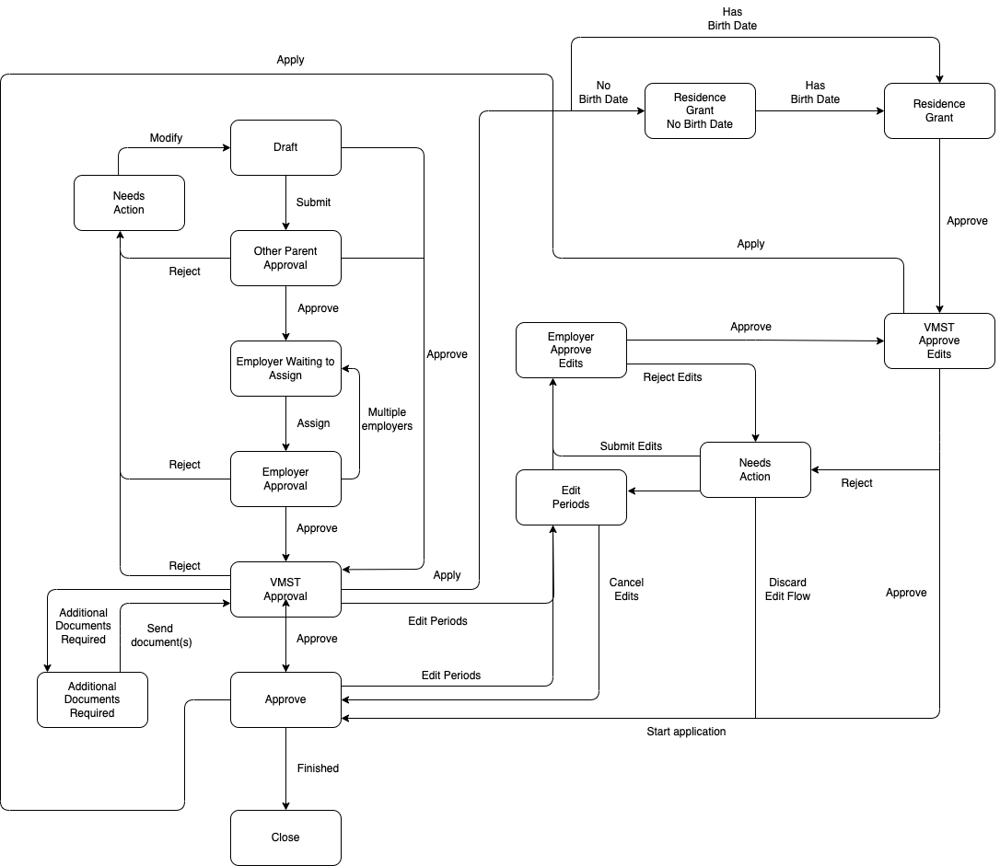

# Parental Leave Application Template

## Description

This application template allows applicants to apply for parental leave. For further reading about application templates, have a look at [the reference template](../reference-template/README.md).

- It contains all the steps for parents and employers required to collect and confirm all information
- It handles communications with external APIs to filter out valid applicants as well as sending complete applications to Vinnumálastofnun

Below you'll find a flow chart for the application:

### Glossary

| Word             | Description                   |
| ---------------- | ----------------------------- |
| Primary parent   | The mother carrying the child |
| Secondary parent | The other parent              |
| VMST             | Vinnumálastofnun              |

### States

This section assumes that you are familiar with [states](../../core/README.md#states).

#### Prerequisites

This state is a temporary state that all new applications will be created in. It has a short lifespan and is unlisted.

The purpose of this state is to be a guard into the actual application. There is an external data step which fetches data from VMST and Þjóðskrá to check if the applicant is expecting a child. If no child is found we ask the applicant if they are applying for parental-leave / parental-grant due to adoption, foster care or father-without-mother. If they are not they cannot advance to the next step and make an application.

Applicants choose which application type ( parental-leave, parental-grant or parental-grant-students ) they are applying for. How many children will give birth.

#### Draft

Valid applicants will be able to advance to this state where they can start the actual application and fill in all the relevant data.

#### Other parent approval

When the primary parent requests transferal of rights, then the other secondary parent will need to approve of the transfer. The other parent will receive an email with a link to approve of this request.

#### Employer waiting to assign

If the applicant is employed by an employer(s) (not self employed, getting benefits or applying for a parental-leave grant), then they are asked to provide an email address which a confirmation email will be sent to. When the employer receives the email they can click a link which automatically assigns them to the application and advances it to the next state. If the applicant has multiple employers we go back to this state after an employer has approved the request until there are no more employers.

#### Employer approval

Here the employer will have a chance to review the periods selected by the applicant as well as pension fund and union.

The employer(s) can then approve or request changes, one employer at a time since just one assignee can be at one state at a time.

#### VMST approval

Applications that have been sent to VMST.

#### Edit or add periods

Applicants make changes in periods or/and add more periods in their application.

#### Residence grant no birthdate

Applicant tries to apply for residence grant but havn't given birth to the child, so they cannot apply.

#### Residence grant

If the applicant has given birth and it has been less than 6 months they can apply for residence grant.

#### Employer approval edits

Employers review new periods selected/added by applicants then approve or request changes.

#### VMST approve edits

Application that has been edited (edit perios or applied for residence grant) have been sent to VMST again.

#### Additional document required

VMST asks for additional documents while processing the application.

#### Approve

Applicantions have been approved by VMST.

#### Close

Applicants finished all his/her rights or parental-leave time is expired.

### Parental leave template API module

For async actions that require server side logic we have the template api modules. The module for this application contains email templates as well as external actions like `sendApplication`.

Have a look at [the parental leave template API module](../../template-api-modules/src/lib/modules/templates/parental-leave/parental-leave.module.ts) for further information on these actions, and [template API module README](../../template-api-modules/README.md) to get up to speed on template api modules.

### API and X-Road

All user interactions go through our GraphQL API (`api`) which is integrated with with other APIs.

To communicate with VMST a request has to go through [X-Road](../../../../handbook/technical-overview/x-road/straumurinn-usage-and-operation.md). Both in development and on production environments.

To connect to VMST test API you'll want to start the [local proxy](../../../../README.md#running-proxy-against-development-service) (also see [AWS secrets](../../../../handbook/repository/aws-secrets.md#getting-started)).

See [directorate of labour graphql API module](../../../api/domains/directorate-of-labour/src/lib/directorate-of-labour.module.ts) for examples of VMST communication.

### Localisation

All localisation can be found on Contentful.

- [Parental leave application translations](https://app.contentful.com/spaces/8k0h54kbe6bj/entries/pl.application)
- [Application system translations](https://app.contentful.com/spaces/8k0h54kbe6bj/entries/application.system)


When creating new text strings in the messages.ts file for the application, be sure to update Contentful, see [message extraction](../../../localization/README.md#message-extraction).


### Emails

As previously mentioned, the application sends out emails to applicants and assignees. The email templates are stored in the parental leave api template module.

When developing locally you’ll see preview links for would-be emails where you can see how they would be rendered and click links.

## Setup

See [application-system](../../../../apps/application-system/README.md) setup on how to get started.

To run the application system you'll need to run three apps:

- `application-system-api`
  - Fetch secrets using: `yarn get-secrets application-system-api`
- `api`
  - Fetch secrets using: `yarn get-secrets api`
- `application-system-form`

Once you have everything running you can navigate to [http://localhost:4200/umsoknir/faedingarorlof](http://localhost:4200/umsoknir/faedingarorlof) and start developing.

### Local database

By setting up the application-system you'll have created a local postgres database on a docker image, if you haven't already you should setup a tool to interact with your database. For example [pgAdmin](https://www.pgadmin.org/download/).

You’ll find the relevant connection information in [the docker-compose file](../../../../apps/application-system/api/docker-compose.base.yml).

## Investigating errors

When investigating errors on our enviornments we have two logging services. `Datadog` for backend services and `Sentry` for the client.

### Datadog

- env: `dev` | `staging` | `prod`
- service: `api` | `application-system-api`

### Sentry

- Can select `dev` / `staging` / `prod` from the environment dropdown
- Can filter by url with id to find a single application experiencing errors
  - `url:https://island.is/umsoknir/:id`

## Future work

### Screens for users that are no longer assignees

When the application is opened/refreshed by a user that was an assignee but no longer is, we might want to show them something - we get their national registry id so we could see if it is the other parent visting or the employer, even though they are not an assignee anymore and show them something relevant like "The application is no longer in a state you can interact with". This is too specific for the application system to know and handle, although the application system should show some message to a user visiting an application that is not an assignee.

### Localisation in emails

Emails are currently hardcoded, need to pass in localisation functions to be able to use translation strings. Also need to sync with service-portal to know what locale the user prefers.

### Other parent asks for personal allowance

Other parent should be able to ask the primary parent for personal allowance. Now only primary parent can ask the other parent for personal allowance.

### Non-custodial parent

If primary parent doesn't give non-custodial parent consent that they is allowed right of access during the parental leave (grant) they should not be able to apply for parental leave (grant).
