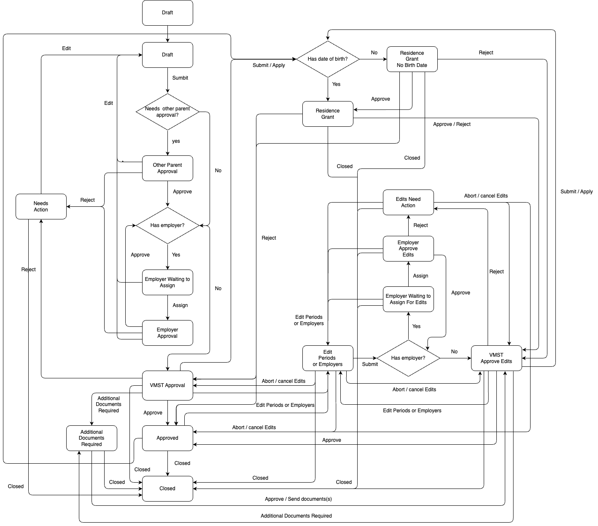

```markdown
# Parental Leave Application Template

## Description

This application template enables applicants to apply for parental leave. For more information on application templates, refer to [the reference template](../reference-template/README.md).

Key Features:
- Guides parents and employers through the required steps to collect and confirm all necessary information.
- Manages communication with external APIs to verify applicant eligibility and submit completed applications to Vinnumálastofnun (VMST).

Below is a flow chart illustrating the application process:



### Glossary

| Term              | Definition                                   |
| ----------------- | -------------------------------------------- |
| Primary parent    | The mother carrying the child                |
| Secondary parent  | The other parent                             |
| VMST              | Vinnumálastofnun, the Directorate of Labour |

### States

This section presumes familiarity with [states](../../core/README.md#states).

#### Prerequisites

This is a temporary, short-lived, and unlisted state for all new applications. Its purpose is to serve as a checkpoint into the complete application process. An external data step fetches information from VMST and Þjóðskrá to verify if the applicant is expecting a child. If no child is detected, the system prompts the applicant to confirm if they are applying for parental leave due to adoption, foster care, or in the case of a father without a mother. Without eligibility, progression to the next step is not possible.

Applicants choose the application type (parental leave, parental grant, or parental grant for students) and indicate the number of expected children.

#### Draft

Eligible applicants progress here to begin the application and provide all necessary data.

#### Other Parent Approval

If rights transfer is requested by the primary parent, the secondary parent must approve this through a link sent via email.

#### Other Parent Requires Action

If the secondary parent requests application edits instead of approving the transfer, the primary parent's application is updated to enable these changes.

#### Employer Waiting to Assign

If employed (not self-employed or receiving benefits), the applicant must provide an employer's email for confirmation. Multiple employers must sequentially approve the application.

#### Employer Approval

Employers review and approve or request changes to the periods selected by the applicant and related details (e.g., pension fund, union).

#### Employer Requires Action

Applications needing employer-requested amendments are updated for the applicant to revise accordingly.

#### VMST Approval

Applications submitted to VMST for processing.

#### VMST Requires Action

When VMST requests changes, the applicant must update their application accordingly.

#### Edit or Add Periods

Applicants modify or add periods and/or employers. Changing employers requires uploading a confirmation document.

#### Employer Waiting to Assign for Edits

When modifications occur and an employer is involved, the original employer is notified to reassess. The state resets for additional employers until clearance.

#### Residence Grant No Birthdate

Applicants cannot apply for a residence grant if the child has not been born.

#### Residence Grant

If the applicant has given birth and it has been under six months, they may apply for a residence grant.

#### Employer Approval Edits

Employers review and approve or request changes on newly added periods by the applicant.

#### Employer Requires Action on Edits

Employer-request changes necessitate the applicant to amend their initial modifications.

#### VMST Approve Edits

Edited applications resubmitted to VMST.

#### VMST Requires Action on Edits

VMST-requested changes require the applicant to implement edits.

#### Additional Document Required

VMST may request supplementary documents during processing.

#### Approve

Applications approved by VMST are finalized.

#### Close

Once applicants exhaust their rights or the parental leave period expires, the application closes.

### Parental Leave Template API Module

Async server-side actions utilize template API modules, containing email templates and functions like `sendApplication`. For more, explore the [parental leave template API module](../../template-api-modules/src/lib/modules/templates/parental-leave/parental-leave.module.ts) and the [template API module README](../../template-api-modules/README.md).

### API and X-Road

Interactions occur through our GraphQL API (`api`), integrated with other APIs.

VMST communication requires the use of [X-Road](../../../../handbook/technical-overview/x-road/straumurinn-usage-and-operation.md) in both development and production.

To connect with VMST's test API, initiate the [local proxy](../../../../README.md#running-proxy-against-development-service). Reference the [AWS secrets](../../../../handbook/repository/aws-secrets.md#getting-started) for details.

See the [directorate of labour GraphQL API module](../../../api/domains/directorate-of-labour/src/lib/directorate-of-labour.module.ts) for VMST examples.

### Localization

Localization assets are hosted on Contentful:

- [Parental Leave Application Translations](https://app.contentful.com/spaces/8k0h54kbe6bj/entries/pl.application)
- [Application System Translations](https://app.contentful.com/spaces/8k0h54kbe6bj/entries/application.system)


When adding new text strings in the `messages.ts` file, ensure updates are made in Contentful, as outlined in [message extraction](../../../localization/README.md#message-extraction).


### Emails

Emails are sent to applicants and assignees, with templates in the parental leave API module.

During local development, email previews are provided to depict how they would render, with clickable links.

## Setup

Refer to the [application-system](../../../../apps/application-system/README.md) setup guide.

To operate the application system, the following apps must be running:

- `application-system-api`
  - Fetch secrets: `yarn get-secrets application-system-api`
- `api`
  - Fetch secrets: `yarn get-secrets api`
- `application-system-form`

Once set up, access the application at [http://localhost:4200/umsoknir/faedingarorlof](http://localhost:4200/umsoknir/faedingarorlof) to begin development.

### Local Database

Setting up the application-system creates a local PostgreSQL database within a Docker container. Use tools like [pgAdmin](https://www.pgadmin.org/download/) to interface with your database. The connection details are in [the Docker compose file](../../../../apps/application-system/api/docker-compose.base.yml).

## Error Investigation

For error analysis, we use `Datadog` for backend logging and `Sentry` for client-side logging.

### Datadog

- Environment: `dev`, `staging`, `prod`
- Service: `api`, `application-system-api`

### Sentry

- Select `dev` / `staging` / `prod` environments.
- Filter by URL containing the application ID to locate specific errors.
  - `url:https://island.is/umsoknir/:id`

## Future Work

### Screens for Former Assignees

When an ex-assignee accesses the application, we might want to display context-specific messages, indicating they can no longer interact with it.

### Localisation in Emails

Emails need dynamic localization support—integrating translation strings and tracking user locale preferences via the service portal.

### Secondary Parent Personal Allowance Request

The functionality for secondary parents to request personal allowances should be supported, as currently, only primary parents can do so.

### Non-custodial Parent Restrictions

Non-custodial parents require primary parent consent for access during parental leave. Without it, applications should be restricted.
```