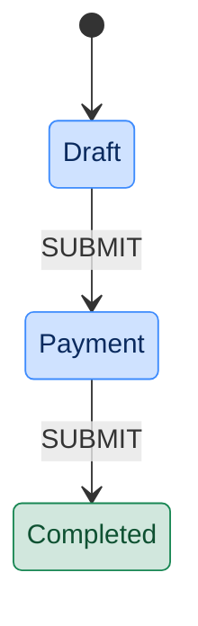

# PAY DEBTS APPLICATION

## About

Application for paying debts owed to the Icelandic state ("Greiðum
ríkinu", `ApplicationTypes.PAY_DEBTS`, slug `greidum-rikinu`). The
applicant picks up one or more outstanding debts fetched from Fjársýsla
ríkisins (FJS) and pays the selected debts via the standard payment flow.

A debt can currently only be paid in full — there is no per-row partial
amount.

- [Template-api-module](https://github.com/island-is/island.is/blob/main/libs/application/template-api-modules/src/lib/modules/templates/pay-debts/pay-debts.service.ts)
- [Finance v3 client (X-Road)](https://github.com/island-is/island.is/tree/main/libs/clients/finance-v3)

## URLs

- [Local - http://localhost:4242/umsoknir/greidum-rikinu](http://localhost:4242/umsoknir/greidum-rikinu)
- [Dev - https://beta.dev01.devland.is/umsoknir/greidum-rikinu](https://beta.dev01.devland.is/umsoknir/greidum-rikinu)
- [Production - https://island.is/umsoknir/greidum-rikinu](https://island.is/umsoknir/greidum-rikinu)

## States

### Draft

The only state the applicant actively fills in. Data fetching from:

- **Finance v3 (FJS)** — `getCustomerDebts` fetches the applicant's
  outstanding debts via X-Road. Local dev needs the X-Road proxy on
  `localhost:8081` running; without it the call fails with
  `ECONNREFUSED` (not a code bug).
- **Mock payment catalog** — `MockPaymentCatalog`, dev/local only, lets
  developers pay without a real charge.

The applicant sees a table of debts (`DebtsLoader` +
`buildInteractiveTableField`) and ticks the ones they want to pay. There
is no per-row amount input — a ticked row always pays the full debt — so
submit is blocked until at least one row is ticked. `Draft` runs on
`EphemeralStateLifeCycle`, so merely opening the form doesn't leave a
30-day draft on Mínar síður.

### Payment

Standard `buildPaymentState` against Fjársýsla ríkisins
(`InstitutionNationalIds.FJARSYSLA_RIKISINS`). Charge items are built
from the selected debts' `chargeTypeId` and `amountToPay`.

**Known gap:** `chargeTypeId` is a charge _category_ (Gjaldflokkur), not
the item-level `chargeItemCode` (Gjaldliður) FJS actually expects —
blocked on FJS exposing the correct per-debt code (or the `payID` it
already sends). See the `TODO` in `src/lib/template.ts`.

### Completed

Terminal state. Shows a conclusion screen only — nothing here confirms
what was actually paid.

## Lifecycle & Notifications

- **Draft / Payment**: `EphemeralStateLifeCycle` — not listed, pruned
  once the applicant moves past them.
- **Completed**: `pruneAfterDays(30)`, `shouldBeListed: false`.
- No scheduled notifications are configured.

## External Services

### Fjársýsla ríkisins (FJS)

Used to fetch the applicant's debts and to create the payment charge.

- [Finance v3 client](https://github.com/island-is/island.is/tree/main/libs/clients/finance-v3)
- [Service](https://github.com/island-is/island.is/blob/main/libs/application/template-api-modules/src/lib/modules/templates/pay-debts/pay-debts.service.ts)

## Testing

- **Gervimaður 010-2989 and 010-2129**
  - Use as the applicant on dev. Both have dummy debt data seeded at FJS,
    so `getCustomerDebts` returns a non-empty debt list for them.
  - Requires the X-Road proxy (`localhost:8081`) running locally to reach
    FJS.
- For local development without X-Road access, use the
  `shouldUseMockPayment` hidden input (dev/local only) to skip to a mock
  payment instead of a real FJS charge.

## Localization

All localisation can be found on Contentful.

- [Pay debts application translations](https://app.contentful.com/spaces/8k0h54kbe6bj/entries/pd.application)
- [Application system translations](https://app.contentful.com/spaces/8k0h54kbe6bj/entries/application.system)

## Project owner

- [Fjársýsla ríkisins](https://island.is/s/fjarsysla-rikisins)

## Code owners and maintainers

- [Origo](https://github.com/orgs/island-is/teams/origo)
  - [Helga Hjartardóttir](https://github.com/helgahjartar)

## Running unit tests

Run `nx test pay-debts` to execute the unit tests via [Jest](https://jestjs.io).
