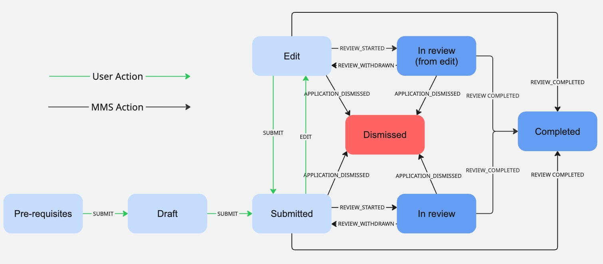

# SECONDARY SCHOOL APPLICATION

## About

Application for secondary school. Applicants can apply for up to 3 different schools and select 1-2 tracks (braut) within those schools. The application period is decided by MMS, during this period applicants should be able to make changes to their existing application and only the latest submitted version is considered by MMS.

[Template-api-module](https://github.com/island-is/island.is/blob/main/libs/application/template-api-modules/src/lib/modules/templates/secondary-school/secondary-school.service.ts)

## URLs

- [Dev](https://beta.dev01.devland.is/umsoknir/framhaldsskoli)
- ~~Staging~~
- [Production](https://island.is/umsoknir/framhaldsskoli)

## States

State diagram for the Secondary School Application showing the states and possible transitions between them. States shown in light blue are states in which the user can make edits and move the application between states, dark blue states are ones where the user can no longer make any edits and all state changes are controlled by MMS. The red dismissed state indicates an application that has been dismissed by MMS, at this point the application is no longer considered active at MMS.

### Pre-requisites

Data fetching from MMS, User Profile and National Registry. Users are blocked from continuing if they already have an active Seconday School application at MMS. Users are blocked from continuing if they haven't registered their email and phone number in the island.is User Profile, an exception is made when the user is making an application on behalf of someone else using a delegation as they cannot edit the user profile.

### Draft

Users fill in personal information, school selection and additional information. Once this is completed and validated they can submit the application to MMS. Users can only have one application in draft state.

### Submitted

After the application has been submitted to MMS it awaits processing in this state. During this time the user can decide to delete or edit their application.

### Edit

If a user decides to edit their already submitted application they can do so as long as MMS hasn't started processing the application. When the application moves into edit state the current answers object (i.e. the application as it was at the time of submission to MMS) is copied into answers.copy. Any modification the user makes is then made to the "normal" answers object. If the user decides to cancel their modifications the old answers object stored in answers.copy is restored and the application is moved back into the Submitted state. If a user submits their edits the data in answers.copy is removed and the application is moved into the Submitted state.

### In Review

Once MMS starts processing an application they send a 'REVIEW_STARTED' event to the application system. In this state the user can no longer edit their application. In case MMS cancels their processing of the application they can send a REVIEW_WITHDRAWN event to move the application back to the previous state. Note that in most cases the processing of an application starts when the application period closes.

### In Review (from edit)

Essentially identical to the In Review state, only difference is this state indicates an application was in the edit state when MMS processing started. Note that if a user did not submit their edits to MMS before MMS began their processing those edits are not considered during the processing.

### Completed

Once MMS finishes their processing of an application they send a REVIEW_COMPLETED event to the application system, at this point the application is considered completed and no further actions can be taken.

### Dismissed

If MMS considers an application invalid for whatever reason (usually the applicant obviously applied for the wrong school/track) they can dismiss the application. Once an application has been dismissed it is no longer considered active and the applicant can create a new application from scratch.

## External Services

### MMS 

- [Swagger](https://redocly.github.io/redoc/?url=https://raw.githubusercontent.com/island-is/island.is/refs/heads/main/libs/clients/secondary-school/src/clientConfig.json)
- [Client](https://github.com/island-is/island.is/blob/main/libs/clients/secondary-school/src/lib/secondarySchoolClient.service.ts)

Used to fetch student info (including if the applicant has an active application already, if true the user is stopped from moving beyond pre-requsites), submit application and edit application

### User Profile

Used to fetch email and phone number to be used in the application. This also allows us to send confirmed email and phone number to MMS for use by the selected school(s)

- [Service](https://github.com/island-is/island.is/blob/main/libs/application/template-api-modules/src/lib/modules/shared/api/user-profile/user-profile.service.ts)

### National Registry

Used to fetch base information about the applicant, as well as information about legal guardians. Note: currently uses a mix of v1 and v3 of the national registry service

- [Service](https://github.com/island-is/island.is/blob/main/libs/application/template-api-modules/src/lib/modules/shared/api/national-registry/national-registry.service.ts)

## Testing
Any fake user should be able to submit an application, but applicants under the age of 18 have special handling to add their Legal Guardians as contacts. Furthermore, MMS has pre-flagged some users as Freshmen so those users skip the Freshman/General Applicant choice.

- Birta Hlín ÞÍ Lulic (160-1430)
  - Marked as freshman
  - Has Legal Guardians (can use delegation to act on Birta's behalf)
    - Elmar ÞÍ Þórarinsson (070-1429)
    - Viktoría Ösp ÞÍ Sveinsdóttir (190-1419)
- María Sól ÞÍ Torp (220-1499)
  - Marked as fresman

## Localization

All localisation can be found on Contentful.

- [Secondary School application translation](https://app.contentful.com/spaces/8k0h54kbe6bj/entries/ss.application)
- [Application system translations](https://app.contentful.com/spaces/8k0h54kbe6bj/entries/application.system)

## Project owner

- [Miðstöð menntunar og skólaþjónustu](https://island.is/s/midstod-menntunar-og-skolathjonustu)

## Code owners and maintainers

- [Origo]
  - Jón Arnar
  - Jóhanna Agnes
