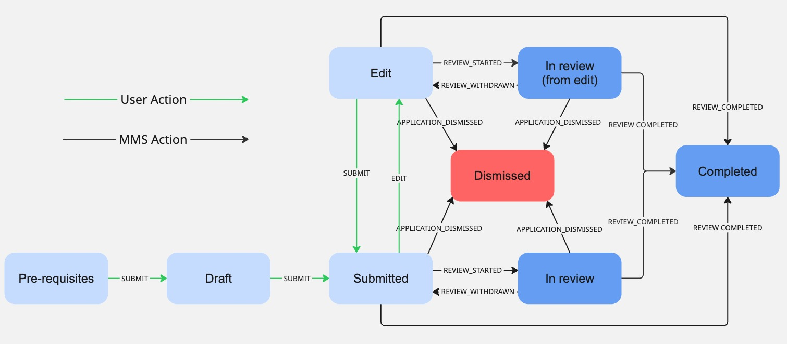

# SECONDARY SCHOOL APPLICATION

## About

Application for secondary school. Applicants can apply for up to 3 different schools and select 1-2 tracks (braut) within those schools. The application period is decided by MMS, during this period applicants should be able to make changes to their existing application and only the latest submitted version is considered by MMS.

[Template-api-module](https://github.com/island-is/island.is/blob/main/libs/application/template-api-modules/src/lib/modules/templates/secondary-school/secondary-school.service.ts)

## URLs

- [Dev](https://beta.dev01.devland.is/umsoknir/framhaldsskoli)
- ~~Staging~~
- [Production](https://island.is/umsoknir/framhaldsskoli)

## States

State diagram for the Secondary School Application showing the states and possible transitions between them. States shown in light blue are states in which the user can make edits and move the application between states, dark blue states are ones where the user can no longer make any edits and all state changes are controlled by MMS. The red dismissed state indicates an application that has been dismissed by MMS, at this point the application is no longer considered active at MMS.

### Pre-requisites

Data fetching from MMS, User Profile and National Registry. 

* Users are blocked from continuing if they already have an active Seconday School application at MMS. 
* Users are blocked from continuing if they haven't registered their email and phone number in the island.is User Profile, an exception is made when the user is making an application on behalf of someone else using a delegation as they cannot edit the user profile.

### Draft

Users fill in personal information, school selection and additional information. Once this is completed and validated they can submit the application to MMS. Users can only have one application in draft state.

#### Applicant Personal Information

* Name, national ID and address are fetched from the national registry
* Email and phone number are fetched from the user profile, if either of these are missing the user is blocked from moving forward until they add the missing information to their user profile. If the user is applying on behalf of someone else using delegation they can manually enter phone and email.
* If the current period allows freshman applications (as per externalData.applicationPeriodInfo.data.allowFreshmanApplication) the user can select if they are a freshman or general applicant, if the user is pre-flagged as a freshman by MMS (as per externalData.studentInfo.data.isFreshman) this step is skipped and they are automatically considered a freshman applicant.
  * This is since the MMS data on primary school graduates isn't complete, for example it will not have data on applicants graduating primary school abroad.

#### Contact Information

* If the applicant is under 18 years old their legal guardians are automatically added as contacts to the application, this is done by fetching the legal guardian information from the national registry. The user needs to input their email and phone number.
* Every applicant can add additional contacts to their application, but it's not required.

#### School and track (program) selection

* Freshmen need to select at least 2 schools and can also add a third. For each school they must select a track (braut) they want to apply for as well as a backup track (braut til vara).
  * If the user selects a specialNeeds track (starfsbraut), which is noted in the dynamic query to GetSecondarySchoolProgramsBySchoolId, any further school and track selection is optional.
  * If only one school is open for applications the requirement to select a 2nd school is omitted. Same if a school only offers a single track, then there is no requirement to select a second track.
* General applicants need to select at least 1 school with an option to select a second school. For each school they must select a track, there is no option of a backup track.
* If a user selects a specialNeeds track they get an alertMessage informing them that a track they've chosen is intended for students who require special assistance in their studies. This is to ensure that applicants are aware of the special needs track and don't accidentally select it without understanding the implications, as this could lead to their application being rejected by MMS.
* Some tracks have a programApplicationMessage, if this is present it will be shown in an alertMessage under the track selection dropdown.
  * This *should* only be used for tracks that require special extra information such as athletic or music tracks that require information about applicants' extracurricular activities in those areas.
* For every school, applicants can optionally select a third language as well as a nordic language if they have a background in a language other than Danish.
  * List of third and nordic languages are fetched from MMS and found in externalData.schools.data
  * Some schools require the selection of a third language, this is found in externalData.schools.data in the requiresThirdLanguage property.
  * //TODO: texti um pósta
* Schools can add an option for applicants to request a dormitory, this is controlled by the allowRequestDormitory field in the school data fetched from MMS.

#### Additional information

* Applicants can select their mother tongue if different from Icelandic
* Applicants can also provide additional information in a free text field and upload documents if they wish
  * Note that for both those options we want to limit sensitive personal information being shared at this point, this should ideally just be generic information and specifics can be communicated to the admitting school directly if needed.

### Submitted

After the application has been submitted to MMS it awaits processing in this state. During this time the user can decide to delete or edit their application.

### Edit

If a user decides to edit their already submitted application they can do so as long as MMS hasn't started processing the application. When the application moves into edit state the current answers object (i.e. the application as it was at the time of submission to MMS) is copied into answers.copy. Any modification the user makes is then made to the "normal" answers object. If the user decides to cancel their modifications the old answers object stored in answers.copy is restored and the application is moved back into the Submitted state. If a user submits their edits the data in answers.copy is removed and the application is moved into the Submitted state.

### In Review

Once MMS starts processing an application they send a 'REVIEW_STARTED' event to the application system. In this state the user can no longer edit their application. In case MMS cancels their processing of the application they can send a REVIEW_WITHDRAWN event to move the application back to the previous state. Note that in most cases the processing of an application starts when the application period closes.

### In Review (from edit)

Essentially identical to the In Review state, only difference is this state indicates an application was in the edit state when MMS processing started. Note that if a user did not submit their edits to MMS before MMS began their processing those edits are not considered during the processing and the user will see the answers from answers.copy in the overview section.

### Completed

Once MMS finishes their processing of an application they send a REVIEW_COMPLETED event to the application system, at this point the application is considered completed and no further actions can be taken.
MMS can also send a REVIEW_COMPLETED event for an application in submitted/edit state without sending a REVIEW_STARTED event.

### Dismissed

If MMS considers an application invalid for whatever reason (usually the applicant obviously applied for the wrong school/track) they can dismiss the application. Once an application has been dismissed it is no longer considered active and the applicant can create a new application from scratch.

## Application specifics

### Users & Delegations
Most applicants are children who are about to finish primary school, their legal guardians can apply on their behalf as well as access and edit their application.
User can grant others a delegation to apply on their behalf, in which case they get full access to view and edit the application.

### Application period and deadlines
MMS defines the active application period which has an end date and review start date (which can differ for freshmen and general applicants) as well as whether or not the application period concerns freshman. All of this information is found in externalData.applicationPeriodInfo.data.
As stated in the pre-requisites section users can only have 1 active application at MMS per application period, MMS is responsible for making sure this behavior is consistent across different application periods and what is considered an "active application".
Once the application period ends MMS should send a REVIEW_STARTED event for all applications that are still in submitted or edit state, triggering a state change.

### Emails and notifications
When an application is deleted or submitted the application system sends an email to the applicant and listed legal guardians (as per answers.custodians).
Once an application has been processed at MMS they will send the results of the application to the applicant's pósthólf. This process is outside the scope of the application system, applicants will see no information about the result of their application in the application system.

## External Services

### MMS 

- [Swagger](https://redocly.github.io/redoc/?url=https://raw.githubusercontent.com/island-is/island.is/refs/heads/main/libs/clients/secondary-school/src/clientConfig.json)
  - [Client](https://github.com/island-is/island.is/blob/main/libs/clients/secondary-school/src/lib/secondarySchoolClient.service.ts)

Used to fetch student info, school and track information as well as to submit applications.

### User Profile

Used to fetch email and phone number to be used in the application. This also allows us to send confirmed email and phone number to MMS for use by the selected school(s)

- [Service](https://github.com/island-is/island.is/blob/main/libs/application/template-api-modules/src/lib/modules/shared/api/user-profile/user-profile.service.ts)

### National Registry

Used to fetch base information about the applicant, as well as information about legal guardians. Note: currently uses a mix of v1 and v3 of the national registry service

- [Service](https://github.com/island-is/island.is/blob/main/libs/application/template-api-modules/src/lib/modules/shared/api/national-registry/national-registry.service.ts)

## Testing
Any fake user should be able to submit an application, but applicants under the age of 18 have special handling to add their Legal Guardians as contacts. 
Furthermore, MMS has pre-flagged some users as Freshmen so those users skip the Freshman/General Applicant choice.

Note that this test data could be outdated.

- Birta Hlín ÞÍ Lulic (160-1430)
  - Marked as freshman
  - Has Legal Guardians (can use delegation to act on Birta's behalf)
    - Elmar ÞÍ Þórarinsson (070-1429)
    - Viktoría Ösp ÞÍ Sveinsdóttir (190-1419)
- María Sól ÞÍ Torp (220-1499)
  - Marked as freshman

## Localization

All localisation can be found on Contentful.

- [Secondary School application translation](https://app.contentful.com/spaces/8k0h54kbe6bj/entries/ss.application)
- [Application system translations](https://app.contentful.com/spaces/8k0h54kbe6bj/entries/application.system)

## Project owner

- [Miðstöð menntunar og skólaþjónustu](https://island.is/s/midstod-menntunar-og-skolathjonustu)

## Code owners and maintainers

- [Origo]
  - Jón Arnar
  - Jóhanna Agnes
