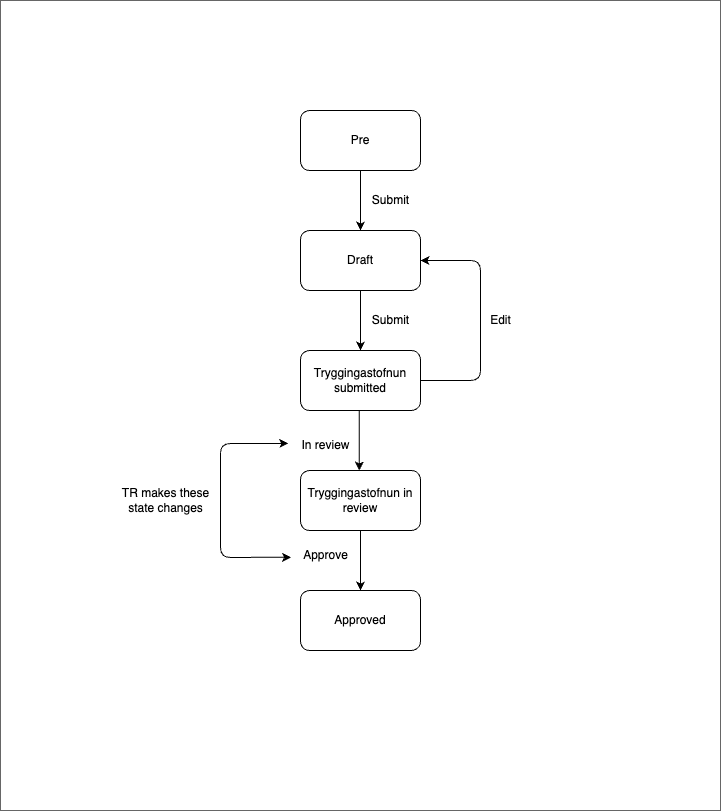

# Application Templates Income Plan

## Description

This application template allows submit a income plan following an application.

### States

#### Prerequisites

This state is a temporary state that all new income plans will be created in. It has a short lifespan and is unlisted.

The purpose of this state is to be a guard into the actual income plan. There is an external data step which fetches data from Þjóðskrá and TR. The applicant cannot advance if they have a previous income plan that has been less than 10 day in progress at TR.

#### Draft

Valid applicant will be able to advance to this state where they can start to look through their pre-filled income plan and make changes. If they already have an income plan at TR, make changes to that one they get to see a temporary calculation before sending in the updated income plan.

#### Tryggingastofnun submitted

When applicant has sent in the income plan to TR the application is in this state. Here the income plan can be edited.

#### Tryggingastofnun in review

For the income plan to be in this state, TR need to make a state change when they start reviewing the income plan. Here the application can not be edited.

#### Approved (Processed)

The income plan has been processed by TR.

### Localisation

All localisation can be found on Contentful.

- [Income plan translations](https://app.contentful.com/spaces/8k0h54kbe6bj/entries/ip.application)
- [Application system translations](https://app.contentful.com/spaces/8k0h54kbe6bj/entries/application.system)

When creating new text strings in the messages.ts file for the application, be sure to update Contentful, see [message extraction](../../../../localization/README.md#message-extraction).

## Setup

See [application-system](../../../../../apps/application-system/README.md) setup on how to get started.

Once you have everything running you can navigate to [http://localhost:4242/umsoknir/tekjuaaetlun](http://localhost:4242/umsoknir/tekjuaaetlun) and start developing.

## Running unit tests

Run `nx test application-templates-social-insurance-administration-income-plan` to execute the unit tests via [Jest](https://jestjs.io).
