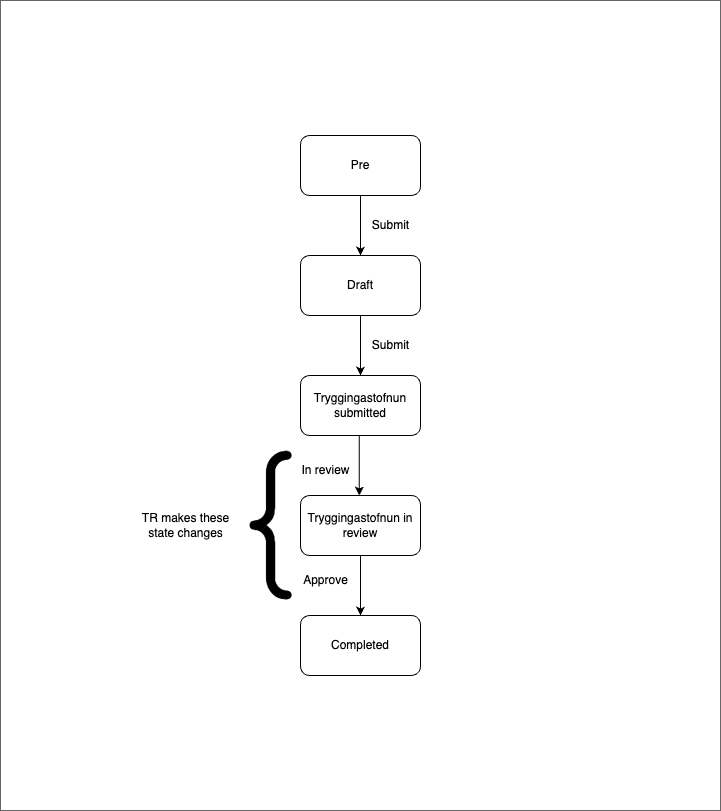

```markdown
# Application Templates Income Plan

## Description

This application template enables users to submit an income plan post-application.



### States

#### Prerequisites

This is a transitory state in which all new income plans are initially created. It is short-lived and unlisted.

The role of this state is to act as a gatekeeper to the actual income plan process. During this state, an external data step fetches data from Þjóðskrá and TR. Applicants cannot proceed if they have an existing income plan that has been in progress at TR for fewer than 10 days.

#### Draft

Eligible applicants can progress to this state, where they can review their pre-filled income plan and make necessary changes. If an income plan already exists at TR, they can modify it and view a temporary calculation before submitting the updated income plan.

#### Tryggingastofnun Submitted

When an applicant submits the income plan to TR, the application moves to this state. At this point, the income plan can still be edited.

#### Tryggingastofnun In Review

For the income plan to enter this state, TR must initiate a state change when they begin reviewing the plan. Once in this state, the application cannot be edited.

#### Approved (Processed)

The income plan has been processed and approved by TR.

### Localization

All localization details can be found on Contentful.

- [Income Plan Translations](https://app.contentful.com/spaces/8k0h54kbe6bj/entries/ip.application)
- [Application System Translations](https://app.contentful.com/spaces/8k0h54kbe6bj/entries/application.system)

When creating new text strings in the `messages.ts` file for the application, ensure they are updated in Contentful. Refer to [Message Extraction](../../../../localization/README.md#message-extraction).

## Setup

Refer to the [Application System Setup](../../../../../apps/application-system/README.md) guide to get started.

Once you have the system running, visit [http://localhost:4242/umsoknir/tekjuaaetlun](http://localhost:4242/umsoknir/tekjuaaetlun) to begin development.

## Running Unit Tests

Run `nx test application-templates-social-insurance-administration-income-plan` to execute unit tests using [Jest](https://jestjs.io).
```