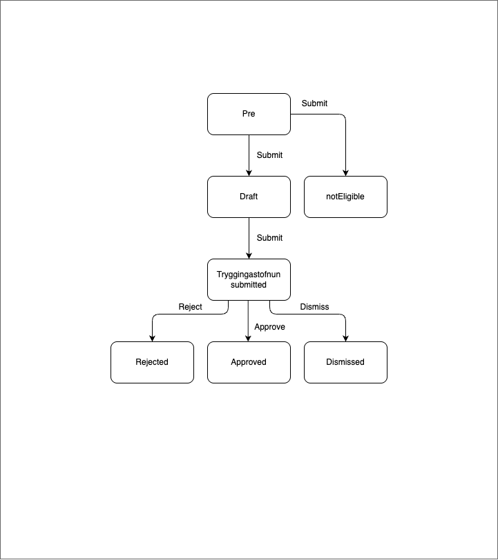

# Medical and Rehabilitation Payments Application Template

This template was generated via `nx generate-template medical-and-rehabilitation-payments` and provides a scaffold for submitting medical and rehabilitation payment requests to the Social Insurance Administration (TR).

## Description

- This application template allows applicants to submit an application for medical and rehabilitation payments to the Social Insurance Administration (TR)
- Gervimenn that can use this application are e.g. Tómas Tinni, tel: 020-1439 and Anna Mary, tel: 201-1489

### States

#### Prerequisites

This state is a temporary state that all new medical and rehabilitation applications will be created in. It has a short lifespan and is unlisted.

The purpose of this state is to be a guard into the actual application. There is an external data step which fetches data from island.is, þjóðskrá and TR. If the applicant is not 18-67, doesn't have a valid base certificate and valid rehabilitation plan or confirmation, they cannot advance to the draft state.

### Not eligible

If the applicant doesn't fulfill the required pre-conditions to apply for medical and rehabilitation payments the application goes to this state, the application cannot advance and the applicant will get a screen detailing why they cannot proceed with an application.

#### Draft

Valid applicants will be able to advance to this state where they can start filling in their details, reviewing the required documentation and answering a self-assesment questionnaire.

#### Tryggingastofnun submitted

When applicant has sent in the application to TR the application is in this state.

#### Approved

The application has been approved by TR.

#### Rejected

Application has been rejected by TR.

#### Dismissed

Application has been dismissed by TR.

All localisation can be found on Contentful.

- [Medical and rehabilitation application translations](https://app.contentful.com/spaces/8k0h54kbe6bj/entries/marp.application)
- [Application system translations](https://app.contentful.com/spaces/8k0h54kbe6bj/entries/application.system)

When creating new text strings in the messages.ts file for the application, be sure to update Contentful, see [message extraction](../../../../localization/README.md#message-extraction).

## Setup

See [application-system](../../../../../apps/application-system/README.md) setup on how to get started.

Once you have everything running you can navigate to [http://localhost:4242/umsoknir/sjukra-og-endurhaefingargreidslur](http://localhost:4242/umsoknir/sjukra-og-endurhaefingargreidslur) and start developing.

## Running unit tests

Run `nx test application-templates-social-insurance-administration-medical-and-rehabilitation-payments` to execute the unit tests via [Jest](https://jestjs.io).
