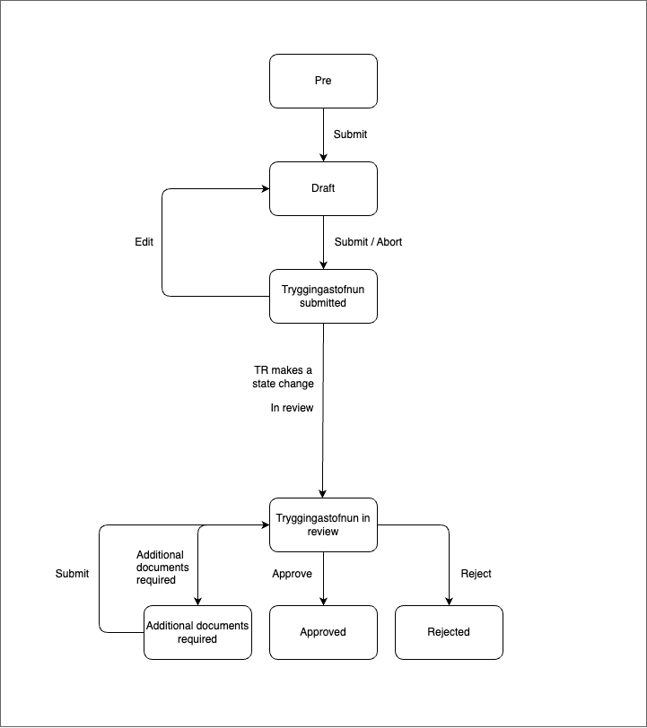

# Application Templates Old age pension

## Description

This application template allows applicants to apply for old age pension.

### States

#### Prerequisites

This state is a temporary state that all new applications will be created in. It has a short lifespan and is unlisted.

The purpose of this state is to be a guard into the actual application. There the applicant chooses type of old age pension (old age pension, half old age pension and sailor's old age pension) and reads general information on the processing and data collection for applications at TR. There is an external data step which fetches data from Þjóðskrá and TR. And lastly there is a question step about if applicant has applied from all their pension funds. If they are already a old-age pensioner, have an application in progress or doesn't have applied for all their pension funds they cannot advance to the next step and make an application.

#### Draft

Valid applicant will be able to advance to this state where they can start the actual application and fill in all the relevant data.

#### Tryggingastofnun submitted

When applicant has sent in the application to TR the application is in this state. Here the application can be edited.

#### Tryggingastofnun in review

For application to be in this state, TR need to make a state change when they start to review the application. Here the application can not be edited.

#### Additional document required

If TR needs additional documents to finish processing the application they can make a state change so the applicant can add their missing documents.

#### Approved

Application has been approved by TR.

#### Rejected

Application has been rejected by TR.

#### Dismissed

Application has been dismissed by TR.

### Localisation

All localisation can be found on Contentful.

- [Old age pension application translations](https://app.contentful.com/spaces/8k0h54kbe6bj/entries/oap.application)
- [Application system translations](https://app.contentful.com/spaces/8k0h54kbe6bj/entries/application.system)

When creating new text strings in the messages.ts file for the application, be sure to update Contentful, see [message extraction](../../../../localization/README.md#message-extraction).

## Setup

See [application-system](../../../../../apps/application-system/README.md) setup on how to get started.

Once you have everything running you can navigate to [http://localhost:4242/umsoknir/ellilifeyrir](http://localhost:4242/umsoknir/ellilifeyrir) and start developing.
