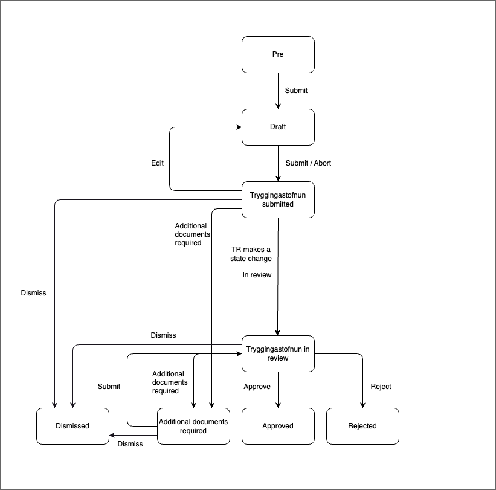

## Application Templates Pension Supplement

### Description

This template enables applicants to apply for a pension supplement.

#### States

- **Prerequisites**: Temporary, short-lived, unlisted state for new applications. Applicants verify eligibility through data checks from Þjóðskrá and TR. To proceed, they must be pensioners and meet domicile and income criteria.

- **Draft**: Eligible applicants can fill in their application details.

- **Tryggingastofnun Submitted**: Application sent to TR. Editable state.

- **Tryggingastofnun In Review**: TR reviews the application. Not editable.

- **Additional Document Required**: TR requests more documents. Application is editable.

- **Approved**: Application approved by TR.

- **Rejected**: Application rejected by TR.

### Localisation

Find all localizations on Contentful:

- [Pension supplement application translations](https://app.contentful.com/spaces/8k0h54kbe6bj/entries/ul.application)
- [Application system translations](https://app.contentful.com/spaces/8k0h54kbe6bj/entries/application.system)

When creating new text strings in `messages.ts` for the application, update Contentful as per the [message extraction guide](../../../localization/README.md#message-extraction).

### Setup

Refer to the [application-system setup](../../../../apps/application-system/README.md) for installation instructions.

After setup, visit [http://localhost:4242/umsoknir/uppbot-a-lifeyri](http://localhost:4242/umsoknir/uppbot-a-lifeyri) to start development.
