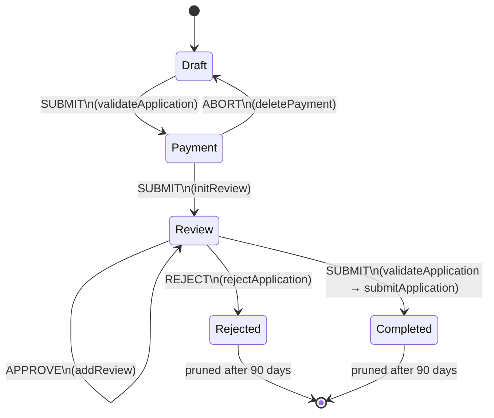

# TRANSFER OF VEHICLE OWNERSHIP

## About

Application for transferring ownership of a vehicle. The seller (applicant) initiates the transfer by selecting a vehicle, entering buyer information, and paying the required fees. After payment, all involved parties (buyer, seller's co-owners, buyer's co-owners and operators) must review and approve the transfer before it is submitted to Samgöngustofa (Icelandic Transport Authority).

[Template-api-module](https://github.com/island-is/island.is/blob/main/libs/application/template-api-modules/src/lib/modules/templates/transport-authority/transfer-of-vehicle-ownership/transfer-of-vehicle-ownership.service.ts)

## URLs

- [Dev](https://beta.dev01.devland.is/umsoknir/eigendaskipti-okutaekis)
- [Production](https://island.is/umsoknir/eigendaskipti-okutaekis)

## States

State diagram for the Transfer of Vehicle Ownership application showing the states and possible transitions between them. Light blue states are editable by the user, dark blue/blueberry states are read-only, and the red Rejected state indicates a rejected transfer.

### Draft

The seller fills in the application: selects a vehicle, enters vehicle details (date of purchase, sale price, mileage), buyer information, and selects an insurance company. On exit, the application is validated against Samgöngustofa before proceeding to payment.

#### Validation (`validateApplication`)

When the application exits the Draft state (and again when it exits the Review state), the `validateApplication` template API action is triggered. This calls Samgöngustofa's `personcheckPost` endpoint via the `VehicleOwnerChangeClient.validateAllForOwnerChange` method, sending the full transfer details (vehicle plate number, seller, buyer, co-owners, operators, date of purchase, sale amount, mileage, and insurance company).

**How validation results are returned and handled:**

1. **Samgöngustofa API behaviour**: The `personcheckPost` endpoint returns success (2xx) if no issues are found. If validation fails, it returns a 4xx error with an array of `ReturnTypeMessage` objects in the response body (either in `body.Errors` for input validation or directly in `body` for data validation).

2. **Client-side error extraction**: The client wraps the API call in a try-catch. On error, `getCleanErrorMessagesFromTryCatch` parses the error body and extracts the error messages. Errors are categorised by severity (`E` = Error, `L` = Lock, `W` = Warning) — all three cause the API to reject the change. To avoid duplicate messages (some errors appear as both `E` and `W`), the function first filters for `E` and `L` errors, and only falls back to `W` errors if none are found. Each error is mapped to an `{ errorNo, defaultMessage }` object, where `errorNo` is a composite of the severity code and the warning serial number (e.g., `E123`). For lock-type errors, the error number is parsed from the error message text instead.

3. **Template API error handling**: The `validateApplication` function checks the returned `OwnerChangeValidation` object. If `hasError` is `true` and there are error messages, it throws a `TemplateApiError` with a generic alert title. This blocks the state transition — the application cannot proceed to Payment (or from Review to Completed).

4. **Client-side re-validation for display**: The template also includes a `ValidationErrorMessages` custom field component that independently calls the `vehicleOwnerChangeValidation` GraphQL query (which calls the same `validateAllForOwnerChange` method). This runs on the overview/conclusion screen before the user submits, displaying any validation errors as a bulleted list inside an `AlertMessage`. Each error is matched against translated message keys in `applicationCheck.validation` using the `errorNo` as a lookup key. If no translation is found, the original `defaultMessage` from Samgöngustofa is displayed, and as a last resort a generic fallback message with the error number is shown.

#### Vehicle Selection

- The applicant's owned vehicles are fetched from the vehicle registry. The display method depends on the number of vehicles:
  - **≤ 5 vehicles**: Displayed as radio buttons, all vehicles are pre-validated for owner change eligibility.
  - **6–20 vehicles**: Displayed as a dropdown, validation occurs when a vehicle is selected.
  - **> 20 vehicles**: A search box is displayed, the user enters a plate number and validation occurs on input.
- If the user has no vehicles, they are blocked from continuing.

#### Vehicle Details

- The seller enters the date of purchase, sale price, and vehicle mileage (if required by the vehicle type).

#### Seller Information

- Seller information (name, national ID) is pre-filled from the applicant's identity. Seller's co-owners are fetched from the vehicle registry and automatically added as reviewers.

#### Buyer Information

- The seller enters the buyer's national ID, name, email, and phone number.
- Optionally they can add a co-owner or co-operator.

#### Payment

- After the draft is validated, the application moves to a payment state. The applicant pays the transfer fee (ownership transfer fee + traffic safety fee) to Samgöngustofa.
- If payment is not completed, the application does not proceed.

### Review

After payment, the application enters the review state. All involved parties are notified via email and SMS that they need to review and approve the transfer. The involved parties are:

- **Buyer**: Must review and approve the transfer. The buyer can also add co-owners and operators to the vehicle during review.
- **Seller's co-owners**: Existing co-owners of the vehicle must approve the transfer.
- **Buyer's co-owners and operators**: If the buyer adds co-owners or operators, they are also added as reviewers and must approve.

Each reviewer sees the application details and can either approve or reject the transfer.

- **APPROVE**: The reviewer's approval is recorded. The application remains in the Review state until all reviewers have approved. Each approval triggers a re-entry to the review state (`addReview` API action) to handle any newly added reviewers.
- **REJECT**: If any reviewer rejects, the payment is deleted (triggering a refund), the application moves to the Rejected state and all parties are notified.
- **SUBMIT** (all approved): Once every reviewer has approved, the transfer is submitted to Samgöngustofa and all parties are notified of the successful transfer. The application moves to the Completed state.

The review state is validated again on exit (via `validateApplication`) since co-owners and operators can be added during review.

#### Pruning

- The application is pruned (automatically deleted) 7 days after creation if not all reviewers have approved. If the payment was fulfilled, the charge is deleted as well.
- A notification is sent to the applicant when the application is pruned.

### Rejected

If any involved party rejects the transfer, the application enters the Rejected state. All parties are notified via email and SMS. The application is pruned after 90 days.

### Completed

Once all parties have approved and the transfer is submitted to Samgöngustofa, the application enters the Completed state. All parties are notified of the successful transfer via email and SMS. The application is pruned after 90 days.

## Application specifics

### Users & Delegations

The applicant (seller) initiates the transfer and the buyer and other reviewers are added to the application as assignees.
Delegations are supported; procuration holders can act on behalf of legal entities and users (both individuals and companies) can delegate their authority to others.

### Roles

- **Applicant (seller)**: Initiates the transfer, selects the vehicle, enters buyer info, and pays. In the Review state, the seller sees a read-only review form and can delete the application.
- **Buyer**: Reviews and approves the transfer. Can add co-owners and operators during review.
- **Reviewer**: Seller's co-owners, buyer's co-owners, and buyer's operators. Must approve the transfer.

### Emails and Notifications

- **initReview** (after payment): All reviewers (buyer, seller's co-owners) receive an email and SMS requesting their review.
- **addReview** (during review): If the buyer adds new co-owners or operators, those newly added reviewers receive an email and SMS.
- **rejectApplication**: All involved parties receive an email and SMS about the rejection.
- **submitApplication** (completed): All involved parties receive an email and SMS confirming the successful transfer.
- **Pruning notification**: The applicant receives a notification when the application is pruned due to timeout.

### Admin Data Config

After pruning, the following fields are retained for admin portal visibility:
- `pickVehicle.plate` (vehicle plate number)
- `buyer.nationalId` (buyer's national ID)
- `buyer.approved`, `buyerCoOwnerAndOperator.$.nationalId`, `buyerCoOwnerAndOperator.$.approved`, `sellerCoOwner.$.nationalId`, `sellerCoOwner.$.approved`

## External Services

### Samgöngustofa (Icelandic Transport Authority)

- [Client - Vehicle Owner Change](https://github.com/island-is/island.is/tree/main/libs/clients/transport-authority/vehicle-owner-change)
- [Client - Vehicle Codetables](https://github.com/island-is/island.is/tree/main/libs/clients/transport-authority/vehicle-codetables)
- [Client - Vehicle Service FJS V1](https://github.com/island-is/island.is/tree/main/libs/clients/vehicle-service-fjs-v1)

Used for validating owner change eligibility, fetching vehicle details, insurance companies, and submitting the ownership transfer.

### Vehicle Registry

- [Client - Vehicles](https://github.com/island-is/island.is/tree/main/libs/clients/vehicles)
- [Client - Vehicles Mileage](https://github.com/island-is/island.is/tree/main/libs/clients/vehicles-mileage)

Used to fetch the applicant's vehicles, vehicle details, co-owners, operators, and mileage readings.

### Payment (FJS)

- [Client - Charge FJS V2](https://github.com/island-is/island.is/tree/main/libs/clients/charge-fjs-v2)

Used for creating and managing payment charges for the transfer.

### Identity & User Profile

- IdentityApi: Fetches name and national ID for the applicant and looked-up users (buyer, co-owners, operators).
- UserProfileApi: Fetches email and phone number from the user's island.is profile.

## Localization

All localisation can be found on Contentful.

- [Transfer of Vehicle Ownership translations](https://app.contentful.com/spaces/8k0h54kbe6bj/entries/ta.tvo.application)
- [Application system translations](https://app.contentful.com/spaces/8k0h54kbe6bj/entries/application.system)

## Project owner

- [Samgöngustofa](https://island.is/s/samgongustofa)

## Code owners and maintainers

- [Origo]

