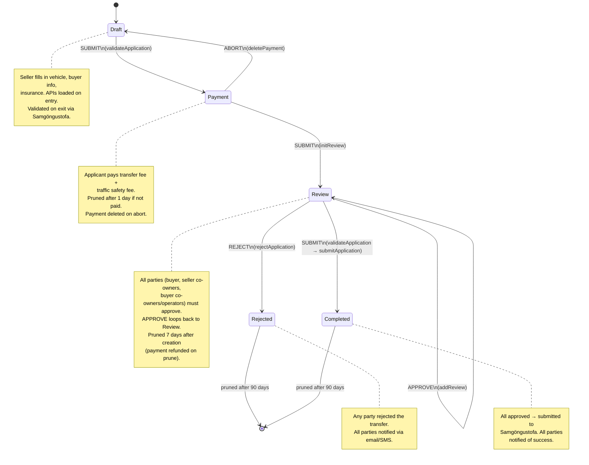

# Transfer of Vehicle Ownership — State Diagram

```mermaid
stateDiagram-v2
    [*] --> Draft

    Draft --> Payment : SUBMIT\n(validateApplication)

    Payment --> Review : SUBMIT\n(initReview)
    Payment --> Draft : ABORT\n(deletePayment)

    Review --> Review : APPROVE\n(addReview)
    Review --> Rejected : REJECT\n(rejectApplication)
    Review --> Completed : SUBMIT\n(validateApplication → submitApplication)

    Rejected --> [*] : pruned after 90 days

    Completed --> [*] : pruned after 90 days

    note right of Draft
        Seller fills in vehicle, buyer info,
        insurance. APIs loaded on entry.
        Validated on exit via Samgöngustofa.
    end note

    note right of Payment
        Applicant pays transfer fee +
        traffic safety fee.
        Pruned after 1 day if not paid.
        Payment deleted on abort.
    end note

    note right of Review
        All parties (buyer, seller co-owners,
        buyer co-owners/operators) must approve.
        APPROVE loops back to Review.
        Pruned 7 days after creation
        (payment refunded on prune).
    end note

    note right of Rejected
        Any party rejected the transfer.
        All parties notified via email/SMS.
    end note

    note right of Completed
        All approved → submitted to
        Samgöngustofa. All parties
        notified of success.
    end note
```

