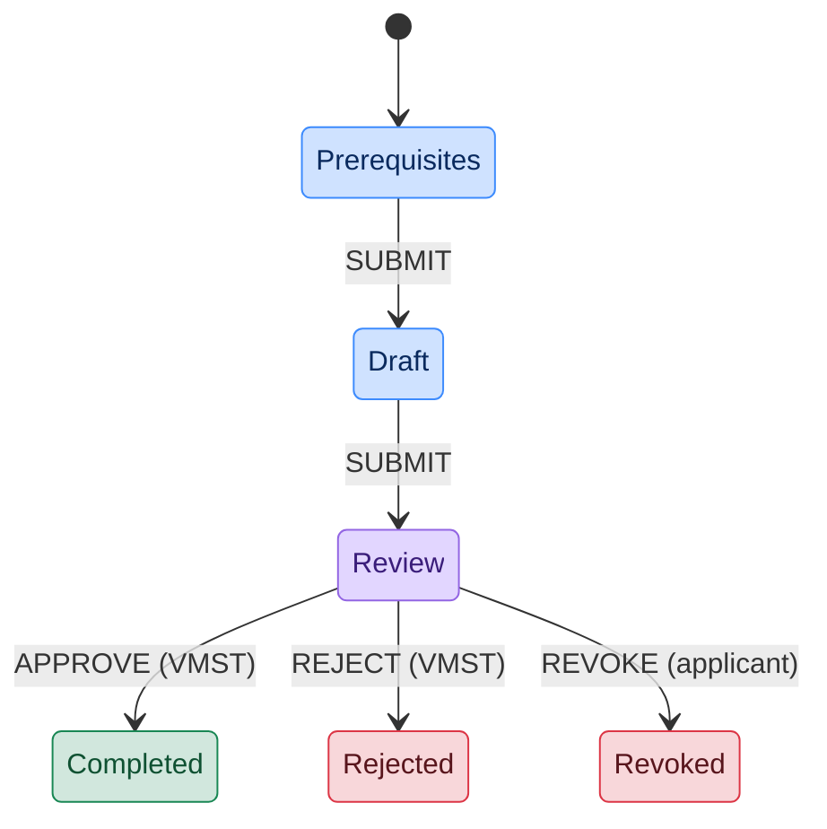

# U2 CERTIFICATE APPLICATION

## About

Application for a U2 certificate issued by Vinnumálastofnun (VMST / The
Directorate of Labour). A U2 certificate lets an unemployed applicant transfer
their Icelandic unemployment benefits while looking for work in another
EES country. A certificate is valid for three months and applicants can
submit an application up to four weeks — but no later than seven days —
before their departure from Iceland.

The application is only available to users who already have an active
unemployment application with VMST; eligibility is validated in the
Pre-requisites step against VMST's `checkU2Eligibility` endpoint.

- [Template-api-module](https://github.com/island-is/island.is/blob/main/libs/application/template-api-modules/src/lib/modules/templates/vmst/u2-certificate/u2-certificate.service.ts)
- [VMST unemployment client](https://github.com/island-is/island.is/blob/main/libs/clients/vmst-unemployment)

## URLs

- [Local](http://localhost:4242/umsoknir/u2-vottord)
- [Dev](https://beta.dev01.devland.is/umsoknir/u2-vottord)
- [Production](https://island.is/umsoknir/u2-vottord)

## States

Colors mirror the action-card tag colors shown in Mínar síður: **blue**
for states the applicant drives, **purple** while VMST is processing the
application, **mint** for the approved terminal, **red** for terminal
states reached via rejection or revocation.

### Prerequisites

Data fetching from:

- **National Registry (v3)** — Applicant information.
- **VMST unemployment client** — `checkU2Eligibility` validates that the
  applicant has an active Icelandic unemployment application and is
  otherwise permitted to apply for a U2 certificate. If not, the user is
  blocked with an explanation returned by VMST (falling back to a generic
  error otherwise).
- **EES countries** — dynamic list of destination countries used later in
  the Draft state.

The Pre-requisites state is ephemeral and pruned automatically.

### Draft

The applicant fills in:

- Destination EES country and departure date (departure must be 7–28 days
  in the future so VMST has time to process the certificate).
- A confirmation that they've reviewed the important information about the
  U2 certificate and understand that responsibility for following its
  conditions rests with the applicant.
- Overview of the collected information.

On submit the `completeApplication` template API runs (via `onExit`) and
the application transitions to Review.

### Review

The application is with VMST. From this state:

- **VMST decides the outcome** — they can transition the application to
  **Completed** (`APPROVE`) or **Rejected** (`REJECT`). These transitions
  are only wired to the `ORGANISATION_REVIEWER` role.
- **The applicant can revoke** — as long as the application is still in
  Review, the applicant can invoke `REVOKE` to move it to **Revoked**.
  `REVOKE` is only wired to the applicant role, so a reviewer cannot fire
  it. Once VMST has approved or rejected, revocation is no longer
  possible.

While in Review the applicant sees a read-only view of their submitted
data with a pending-action alert and a "Revoke application" button.

### Revoked

Terminal state reached by the applicant invoking `REVOKE` from Review.
On entry, the `revokeApplication` template API runs to notify VMST that
the applicant has withdrawn. A defense-in-depth check inside the service
also verifies that the caller is the applicant, though this is already
guaranteed by role wiring in the template.

The applicant can start a fresh U2 application from this state.

### Rejected

Terminal state reached when VMST rejects the application from Review.
The applicant can start a fresh U2 application if their circumstances
change.

### Completed

Terminal state reached when VMST approves the application. The applicant
is instructed to pick up the physical certificate at their nearest VMST
service office in the days before their departure — the U2 does not
come into effect until it is collected in person.

## Lifecycle & Notifications

- **Prerequisites**: ephemeral, not listed, pruned as soon as the applicant
  moves on.
- **Draft / Review / Completed / Revoked / Rejected**: use the default
  state lifecycle — pruned 30 days after entering the state.
- No scheduled notifications are currently configured.

## External Services

### VMST (Vinnumálastofnun)

Used to check U2 eligibility, fetch the list of EES countries, submit the
application, and notify VMST of applicant revocations.

- [Client](https://github.com/island-is/island.is/tree/main/libs/clients/vmst-unemployment)
- [Service](https://github.com/island-is/island.is/blob/main/libs/application/template-api-modules/src/lib/modules/templates/vmst/u2-certificate/u2-certificate.service.ts)

### National Registry

Used to fetch the applicant's information.

- [Service](https://github.com/island-is/island.is/blob/main/libs/application/template-api-modules/src/lib/modules/shared/api/national-registry/national-registry.service.ts)

## Testing

- **Gervimaður 201-1489**
  - Use as the applicant.
  - **Prerequisite:** this gervimaður must already have an _active
    unemployment application_ on VMST's side. Without that, the eligibility
    check in Prerequisites will fail and the application cannot proceed.
    Coordinate with VMST if the test user needs to be (re-)activated.

## Localization

All localisation can be found on Contentful.

- [U2 Certificate translation](https://app.contentful.com/spaces/8k0h54kbe6bj/entries/vmst.u2c.application)
- [Application system translations](https://app.contentful.com/spaces/8k0h54kbe6bj/entries/application.system)

## Project owner

- [Vinnumálastofnun](https://island.is/s/vinnumalastofnun)

## Code owners and maintainers

- [Origo](https://github.com/orgs/island-is/teams/origo)
  - [Baldur Óli](https://github.com/Ballioli)

## Running unit tests

Run `nx test u2-certificate` to execute the unit tests via [Jest](https://jestjs.io).
