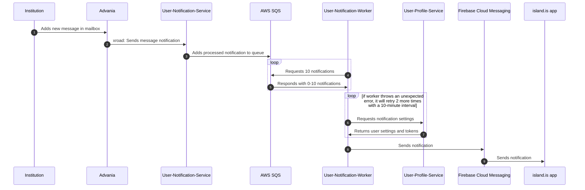

```markdown
# Message Queue

This is a NestJS library for using [Amazon SQS](https://aws.amazon.com/sqs/).

## Quickstart

To use this module locally for development or testing, it's recommended to use an SQS-compatible server that can run in Docker, such as [LocalStack](https://github.com/localstack/localstack).

A simple `docker-compose.yml` might look like:

```yaml
services:
  localstack:
    image: public.ecr.aws/localstack/localstack:3
    networks:
      - local
    ports:
      - 4566:4566
    environment:
      - SERVICES=sqs

networks:
  local:
```

### Import the Queue Module

Import the QueueModule in your NestJS module:

```typescript
import { QueueModule } from '@island.is/message-queue';

// Register the queue in your NestJS module.
// You can call QueueModule.register multiple times with different names
// if you need multiple queues.
@Module({
  imports: [
    QueueModule.register({
      queue: {
        // Identifier for using the queue
        name: 'name-of-queue',
        // Name of the queue in AWS
        queueName: process.env.QUEUE_NAME,
        // You probably want a dead-letter queue
        // Leave options empty for default settings
        deadLetterQueue: {},
      },
      client: {
        // Endpoint should be 'http://localhost:4566' for LocalStack but can be left undefined in production
        endpoint: process.env.SQS_ENDPOINT,
        region: 'eu-west-1',
        credentials: {
          // Both keys can be set to 'testing' for use with LocalStack
          accessKeyId: process.env.SQS_ACCESS_KEY,
          secretAccessKey: process.env.SQS_SECRET_ACCESS_KEY,
        },
      },
    }),
  ],
})
export class MyModule {}
```

### Push Messages to the Queue

```typescript
import { InjectQueue, QueueService } from '@island.is/message-queue';
import { SomeMessageType } from './types';

@Injectable()
export class SomeService {
  constructor(@InjectQueue('name-of-queue') private queue: QueueService) {}

  async addToQueue() {
    // msg can be any JSON-serializable object
    const msg: SomeMessageType = { some: 'data' };
    const uuid = await this.queue.add(msg);
    // It's up to you if or what you use the uuid for
  }
}
```

### Consume Messages from the Queue

```typescript
import { InjectWorker, WorkerService } from '@island.is/message-queue';
import { SomeMessageType } from './types';

@Injectable()
export class SomeWorkerService {
  constructor(@InjectWorker('name-of-queue') private worker: WorkerService) {}

  async run() {
    await this.worker.run(async (message: SomeMessageType) => {
      console.log('Yay, got message', message);
    });
  }
}
```

### Run the Worker from Your Application

```typescript
const worker = async () => {
  const app = await NestFactory.createApplicationContext(AppModule);
  app.enableShutdownHooks();
  await app.get(SomeWorkerService).run();
};

// You might need a check here to decide whether to run the worker or the main application/web server
worker();
```

## System Flow Sequence Diagram



## Running Unit Tests

Run `yarn test message-queue` to execute the unit tests using [Jest](https://jestjs.io).
```