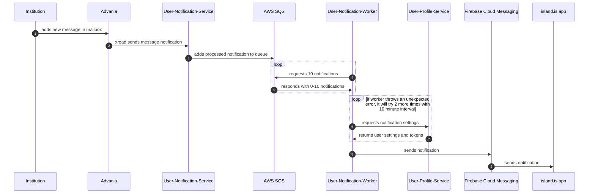

# Message Queue

This is a nest library for using [SQS](https://aws.amazon.com/sqs/)

## Quickstart

To use this module locally in dev/testing it's probably easiest to use a SQS
compatible server that can run in docker, like [Localstack](https://github.com/localstack/localstack)

Simple docker-compose.yml might look something like

```
services:
  localstack:
    image: localstack/localstack
    networks:
      - local
    ports:
      - 4566:4566
    environment:
      - SERVICES=sqs

networks:
  local:
```

Import the queue module in your nest module

```typescript
import { QueueModule } from '@island.is/message-queue'

// Register the queue in your nest module.
// Note you can call QueueModule.register multiple times with different names
// if you need mulitple queues
@Module({
  imports: [
    QueueModule.register({
      queue: {
        // identifier for using the queue
        name: 'name-of-queue',
        // name of queue in AWS
        queueName: process.env.QUEUE_NAME,
        // you probably want a dead-letter queue
        // leave options empty for default settings
        deadLetterQueue: {},
      },
      client: {
        // endpoint should be 'http://localhost:4566' for localstack but can be left undefined in production
        endpoint: process.env.SQS_ENDPOINT,
        region: 'eu-west-1',
        credentials: {
          // both keys can be set to 'testing' for use with localstack
          accessKeyId: process.env.SQS_ACCESS_KEY,
          secretAccessKey: process.env.SQS_SECRET_ACCESS_KEY,
        },
      },
    }),
  ],
})
export class MyModule {}
```

Push messages to the queue

```typescript
import { InjectQueue, QueueService } from '@island.is/message-queue'
import { SomeMessageType } from './types'

@Injectable()
export class SomeService {
  constructor(@InjectQueue('name-of-queue') private queue: QueueService) {}

  async addToQueue() {
    // msg can be any json-serializable object
    const msg: SomeMessageType = { some: 'data' }
    const uuid = await this.queue.add(msg)
    // Up to you if or what you use the uuid for
  }
}
```

Consume messages from the queue

```typescript
import { InjectWorker, WorkerService } from '@island.is/message-queue'
import { SomeMessageType } from './types'

@Injectable()
export class SomeWorkerService {
  constructor(@InjectWorker('name-of-queue') private worker: WorkerService) {}

  async run() {
    await this.worker.run(async (message: SomeMessageType) => {
      console.log('Yay, got message', message)
    })
  }
}
```

Run the worker from your application main.ts

```typescript
const worker = async () => {
  const app = await NestFactory.createApplicationContext(AppModule)
  app.enableShutdownHooks()
  await app.get(SomeWorkerService).run()
}

// might need some check here if we should run the worker or the main application/webserver
worker()
```

## System Flow Sequence Diagram



## Running unit tests

Run `yarn test message-queue` to execute the unit tests via [Jest](https://jestjs.io).
