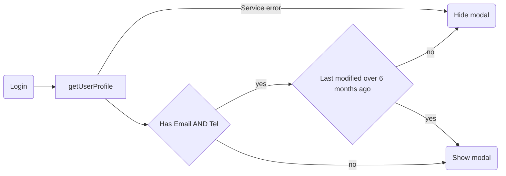

# service-portal-settings

This library was generated with [Nx](https://nx.dev).

## Running unit tests

Run `nx test service-portal-settings` to execute the unit tests via [Jest](https://jestjs.io).

## What

The personal information module is used for changing the user's settings within island.is

## How does it work

The serviceportal user will have data coming from two sources, that can be either the islyklar service or the userprofile service.

Convieniently, those have been joined together for a single call in getUserProfile.

When the user enters the service-portal (/minarsidur) they might be prompted with an onboarding modal. The rule goes like so:

See: `./src/index.ts`
