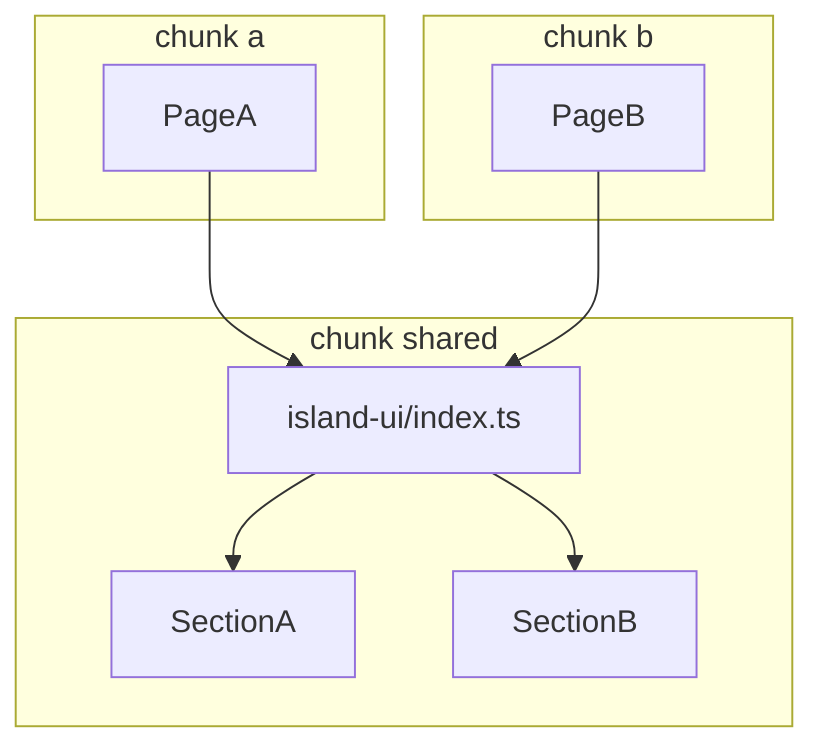
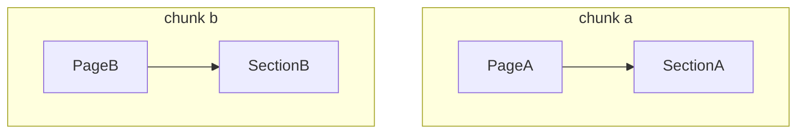

# Babel

Shared Babel presets for optimized importing.

## @island.is/shared/babel/web

This preset configures `babel-plugin-transform-imports` to use deep imports instead of index imports for better code-splitting.

## Deep Imports

When a web app code-splits per page (e.g., NextJS), using deep imports can enhance performance. For example: `PageA` uses a `SectionA` component and `PageB` uses a `SectionB` component, which are both defined in our UI library.

Without deep imports, both pages might import the entire UI library from `index.ts`, leading to unnecessary code inclusion across pages. Tree-shaking cannot always remove this unused code.

Although importing from `index.ts` is better for developer experience, direct module imports are optimal for code-splitting. The preset uses `babel-plugin-transform-imports` to dynamically rewrite import statements. It employs `exportFinder` to identify each module's defining export, enabling more efficient code-splitting.
