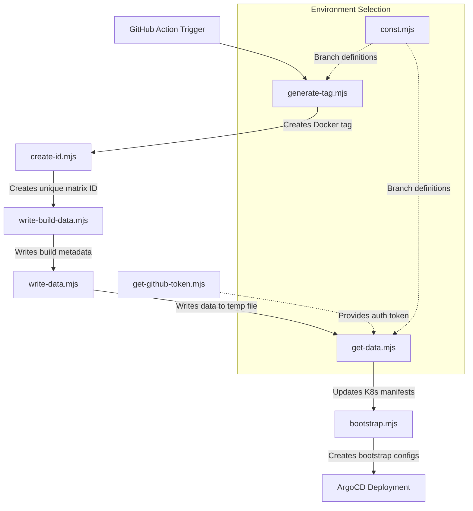

# Docker CI Scripts

This documentation provides a detailed explanation of the CI/CD scripts in the `scripts/ci/docker` directory, which are used for building Docker images and deploying applications to ArgoCD in the island.is project.

## Overview

These scripts form a CI/CD pipeline that:

1. Generates Docker image tags based on branch and event type
2. Creates unique IDs for matrix builds
3. Manages GitHub authentication
4. Updates Kubernetes manifests with new image tags
5. Prepares bootstrap configurations for ArgoCD deployments
6. Writes build data for deployment

The scripts are designed to handle different deployment environments (dev, staging, prod) based on the branch being built (main or release branches).

## Workflow Diagram

## Script Descriptions

### `bootstrap.mjs`

**Purpose**: Creates bootstrap configurations for ArgoCD deployments.

**Functionality**:

- Scans chart directories for environment-specific values files
- Extracts namespace information from these files
- Creates bootstrap YAML files with namespace configurations for each environment (dev, prod, staging)
- Ensures namespaces are properly configured before deployment

### `const.mjs`

**Purpose**: Defines constants used across the CI scripts.

**Functionality**:

- Defines `MAIN_BRANCHES` array (currently only 'main')
- Defines `RELEASE_BRANCHES` array (currently 'release' and 'release/35.1.0')
- These constants determine deployment behavior based on branch

### `create-id.mjs`

**Purpose**: Creates a unique ID for each matrix job in the CI workflow.

**Functionality**:

- Uses UUID v5 to generate a deterministic ID based on affected projects
- Exports the ID as an environment variable for use in other scripts
- Sets `UPLOAD_ARTIFACT_DOCKER` to 'true' to enable artifact uploading

### `generate-tag.mjs`

**Purpose**: Generates Docker image tags and artifact names based on the GitHub event and branch.

**Functionality**:

- Determines if the build should run based on event type and branch
- Creates unique Docker tags with date and random string components
- Formats tags differently for dev vs. production deployments
- Outputs tag information for use in Docker build steps
- Only processes merge group events for main and release branches

### `get-data.mjs`

**Purpose**: Updates Kubernetes manifests with new Docker image tags.

**Functionality**:

- Reads data from a temporary JSON file created by `write-data.mjs`
- Scans chart directories for environment-specific values files
- Updates image tags in these files based on the build data
- Prepares manifests for different environments (dev, staging, prod)
- Outputs a list of changed files for ArgoCD to apply

### `get-github-token.mjs`

**Purpose**: Obtains a GitHub API token for authentication.

**Functionality**:

- Uses GitHub App JWT authentication
- Retrieves installation ID for the GitHub App
- Generates an access token for API operations
- Sets the token as a GitHub Actions output and secret

### `write-build-data.mjs`

**Purpose**: Writes build metadata to GitHub Actions outputs.

**Functionality**:

- Validates required environment variables (PROJECT, TARGET, IMAGE_NAME, IMAGE_TAG)
- Creates a structured object with build information
- Exports variables for use in subsequent steps
- Logs build data for debugging purposes

### `write-data.mjs`

**Purpose**: Processes and writes build data to a temporary file.

**Functionality**:

- Parses JSON data from environment variables
- Restructures the data for consumption by `get-data.mjs`
- Writes the processed data to `/tmp/data.json`

## Deployment Environments

The scripts handle three deployment environments:

1. **Dev**: Deployed from the `main` branch
2. **Staging**: Deployed from release branches
3. **Production**: Deployed from release branches

## Chart Directories

The scripts interact with the following chart directories:

- `charts/islandis-services`
- `charts/judicial-system-services`
- `charts/identity-server-services`
- `charts/bootstrap` (generated during the process)

## Usage in CI/CD Pipeline

These scripts are designed to be used in GitHub Actions workflows, specifically for merge group events. They:

1. Generate appropriate Docker tags based on the branch
2. Create unique IDs for matrix builds
3. Update Kubernetes manifests with new image tags
4. Prepare bootstrap configurations
5. Output information needed for ArgoCD deployments

The workflow only runs for merge group events targeting main or release branches, ensuring that only approved code changes trigger deployments.
